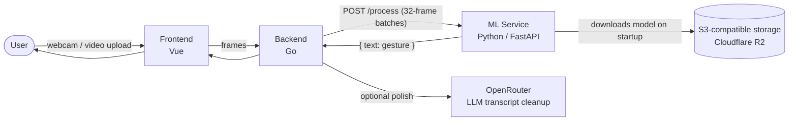

### Turning Russian Sign Language into text, in real time

**🇬🇧 English** · [🇷🇺 Русский](README.ru.md)

---

## About Sigma Sign

**Sigma Sign** is a web application that recognizes **Russian Sign Language (RSL)** from a live webcam feed or an uploaded video and turns it into text — built to make everyday communication more accessible for the deaf and hard-of-hearing community.

It started as a **48-hour hackathon project at HSE University** (December 2025) and has since grown into an ongoing research effort. We're now looking to partner with academics and labs working on sign language recognition, continuous gesture translation, or accessibility-focused ML — see [Collaborating with us](#-collaborating-with-us) below.

## The problem

Sign language is a full, grammatically independent language — but very few hearing people understand it, which creates a real, everyday communication barrier for signers. Sigma Sign's goal is to lower that barrier with a browser-based tool that needs no special hardware: just a camera and a browser tab.

## How it works

1. User opens the site
2. Grants camera access (or uploads a video instead)
3. Presses **Start**
4. Signs in RSL / uploads a clip
5. Gets the recognized text back

## Under the hood: the model

Two things matter most for this kind of live UX: **translation speed** and **accuracy**. That drove the core modeling decisions:

- **Architecture:** S3D (Separable 3D CNN), exported to ONNX for fast CPU/GPU inference.
- **Pretraining → fine-tuning:** pretrained on **Kinetics-400** (general action recognition), then fine-tuned on **[Slovo](https://github.com/hukenovs/slovo)** — an open RSL dataset covering **~1,600 gesture classes**.
- **Why not the off-the-shelf Sber ONNX baseline?** We benchmarked it early on and moved to our own fine-tuned S3D checkpoint instead, after comparing inference speed and accuracy on our target vocabulary.
- **Inference strategy:** a **sliding window** of frames (32 by default) is fed to the model continuously; consecutive duplicate predictions and "no gesture" frames are collapsed into a clean output sequence.

## Architecture

The Go backend streams webcam frames over WebSocket (batched into groups of 32) or extracts frames from an uploaded video with FFmpeg, forwards each batch to the ML service, and optionally polishes the raw literal output into natural, grammatical text via an LLM — while keeping rolling context across batches for coherence.

## See it in action

*("Nice to meet you" and "I really liked it here" — recognized from RSL video input.)*

## Repositories

| Repo | Stack | Role |
| --- | --- | --- |
| [`frontend`](https://github.com/HSE-SignLanguage/frontend) | Vue | Captures webcam frames / video upload, displays the translated text |
| [`backend`](https://github.com/HSE-SignLanguage/backend) | Go | WebSocket streaming, video upload jobs, orchestration, optional LLM transcript polishing, Swagger docs |
| [`ml`](https://github.com/HSE-SignLanguage/ml) | Python / FastAPI | Runs S3D/ONNX inference, returns recognized gestures |

Each repo has its own detailed README (setup, API reference, configuration) — start there for anything implementation-specific.

## Deployment

All three services are containerized and deployed independently via [Dokploy](https://dokploy.com/), a self-hosted PaaS, with per-service logs and rollback. The site isn't publicly reachable right now — reach out if you'd like a walkthrough.

## Known limitations

We're upfront about these, because they're exactly where a research collaboration could help most:

- **Isolated gestures, not continuous signing** — no grammar, non-manual markers (facial expression, mouth patterns), or co-articulation modeling yet.
- **Fixed, closed vocabulary** — ~1,600 classes from Slovo; names, neologisms, and regional variants fall outside it.
- **No cross-window confidence calibration** — overlapping windows fire independently, with only simple de-duplication.
- **Single-signer framing assumptions** — fixed square resizing, no hand/pose-based cropping.
- **Benchmarks not yet published** — formal accuracy/latency protocol is in progress.

## 🗺 Roadmap & open research questions

- Continuous sign language recognition (sentence-level, not isolated gestures)
- Incorporating non-manual markers (facial expression, mouth shape) that carry grammatical meaning in RSL
- Expanding vocabulary beyond Slovo's ~1,600 classes with additional data collection
- Temporal smoothing / voting across overlapping windows
- On-device / mobile export (quantization, smaller backbone) for lower-latency inference
- A formal accuracy/latency benchmarking protocol and public leaderboard

## 🤝 Collaborating with us

Sigma Sign started as a hackathon project built to make everyday communication more accessible for the deaf and hard-of-hearing community. We're now looking to partner with **researchers and labs working on sign language recognition, continuous gesture translation, or accessibility-focused ML** — anywhere in the world.

If any of the open questions above overlap with your research, we'd love to talk: **kuznetsova4ka@gmail.com**

## 📽 Presentation

**[Download the full hackathon pitch deck (PDF)](assets/Sigma-Sign-Presentation.pdf)** — problem statement, model comparison, architecture, and deployment walkthrough.

---

Built by students of HSE University during a 48-hour hackathon · December 2025

