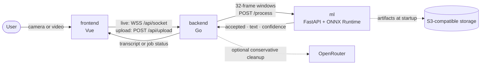

### Russian Sign Language gesture recognition from a webcam or video

**🇬🇧 English** · [🇷🇺 Русский](README.ru.md)

**[Live demo](https://hack.eferzo.xyz/)** · **[Swagger UI](https://hack.eferzo.xyz/swagger/index.html)**

---

## What Sigma Sign is

**Sigma Sign** is an experimental web application that recognizes isolated **Russian Sign Language (RSL)** gestures from a live camera or an uploaded video and builds a text transcript. It runs in a browser and does not require dedicated capture hardware.

The project started at a 48-hour HSE University hackathon in December 2025. It is now a beta research prototype, not a continuous sign-language translator or a replacement for a human interpreter.

## System and request flow

For live recognition, the frontend sends JPEG frames over one WebSocket. The backend builds overlapping 32-frame windows with a stride of 16 and sends them to the internal ML API. For an uploaded video, the backend validates it with `ffprobe`, extracts bounded frame windows with FFmpeg, and exposes progress through `/job/{id}`.

The ML service returns a label, confidence and acceptance decision. In the live path, the backend confirms a gesture across two matching accepted windows before emitting it. OpenRouter can conservatively adjust grammar and punctuation; it is outside the recognition decision and can be disabled.

## Repositories

| Repository | Stack | Responsibility |
| --- | --- | --- |
| [`frontend`](https://github.com/HSE-SignLanguage/frontend) | Vue 3 + Vite | Camera capture, video upload, WebSocket lifecycle, job polling and transcript UI |
| [`backend`](https://github.com/HSE-SignLanguage/backend) | Go + Chi | Public API, frame windows, recognition stabilization, upload jobs and optional transcript cleanup |
| [`ml`](https://github.com/HSE-SignLanguage/ml) | Python + FastAPI + ONNX Runtime | Model artifact loading, frame validation and isolated-gesture inference |

Each service is independently containerized. Configuration and development commands live with the service they affect; begin with the README in [`backend`](https://github.com/HSE-SignLanguage/backend) or [`ml`](https://github.com/HSE-SignLanguage/ml), and the scripts in [`frontend/package.json`](https://github.com/HSE-SignLanguage/frontend/blob/main/package.json).

## Recognition and reliability guardrails

- **Reject uncertainty:** the ML service rejects `no gesture`, low-confidence and low-margin windows instead of returning every top-1 prediction. Live recognition requires two matching accepted predictions and waits for neutral/rejected windows before allowing the same gesture again.
- **Bounded live path:** stale frame work is replaced rather than accumulated. WebSockets have frame, rate, byte, idle, global and per-client limits; ML calls and transcript cleanup use separate bounded queues.
- **Bounded uploads:** files are probed before a job is accepted and limited by size, duration, resolution and extracted-frame count. Upload and processing concurrency are capped.
- **Fail safely:** transient ML overload is retried with bounded jitter. OpenRouter output must satisfy a strict append-only schema within a five-second timeout; invalid or unavailable AI output falls back to the literal recognized gesture.
- **Hardened containers:** current images run as non-root users and expose health checks. Backend and ML compose definitions add resource limits; model artifacts can be pinned with SHA-256 checksums.

## Deployment notes

The public deployment uses one origin: the frontend is served at `/`, while `/api` is routed to the backend with WebSocket upgrades and the prefix stripped. The backend reaches the ML API through internal service DNS; only the ML service needs access to S3-compatible object storage.

When deploying the stack:

- point `ML_API_URL` at stable internal service DNS, not `localhost` from another container;
- configure `TRUSTED_PROXY_CIDRS` with only the actual ingress network so per-client limits cannot be bypassed with forwarded headers;
- keep S3-compatible storage and OpenRouter credentials in deployment secrets, never in Git;
- use `USE_MOCK=true` and `USE_OPENROUTER=false` for UI/backend development without model artifacts or an external LLM.

There is intentionally no organization-level compose file: each repository owns its own build, tests and runtime configuration.

## Known limitations

- The model classifies **isolated gestures per window**; it does not model continuous RSL grammar, co-articulation or non-manual markers such as facial expression and mouth shape.
- The vocabulary is closed at roughly 1,600 labels derived from [Slovo](https://github.com/hukenovs/slovo); names, new words and regional variants can be out of distribution.
- Fixed square resizing without hand/pose tracking makes recognition sensitive to framing, lighting, background and signer variation.
- Stabilization reduces transition noise but adds latency and may suppress an intentional repeated gesture until neutral frames are observed.
- Accuracy and latency benchmarks are not yet published. The live instance has deliberately small capacity limits and may return `503` while busy.
- Upload jobs and live sessions are process-local; a backend restart interrupts active work and does not preserve job state.
- Optional LLM cleanup improves presentation only. It cannot recover a gesture the model recognized incorrectly.

## Research and collaboration

Open directions include continuous recognition, non-manual features, broader data, temporal calibration and reproducible evaluation. Researchers working on sign-language recognition or accessible ML are welcome to contact **kuznetsova4ka@gmail.com**.

The original hackathon context is preserved in the **[Sigma Sign presentation](assets/Sigma-Sign-Presentation.pdf)**.

---

Built by HSE University students during a 48-hour hackathon · December 2025

