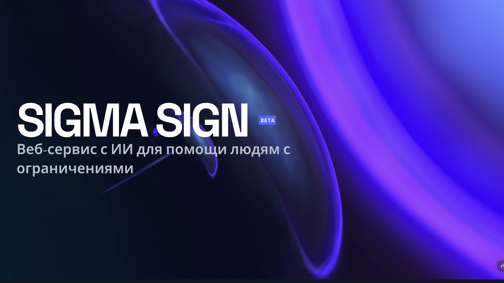
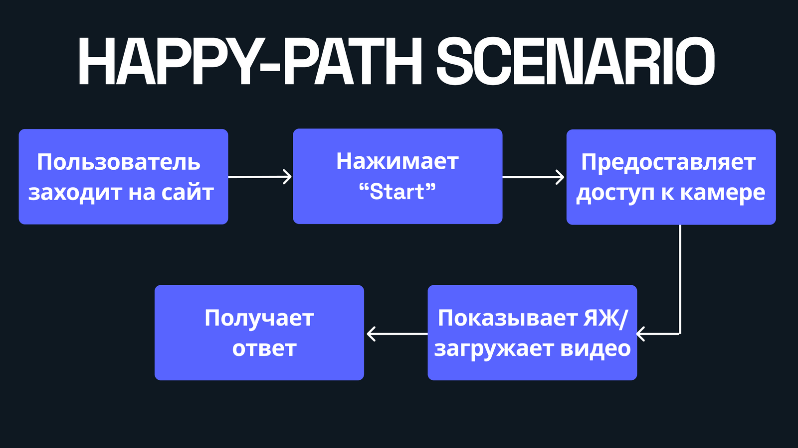
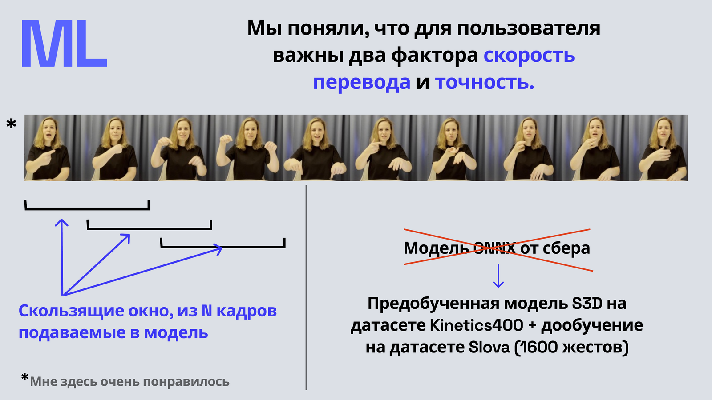
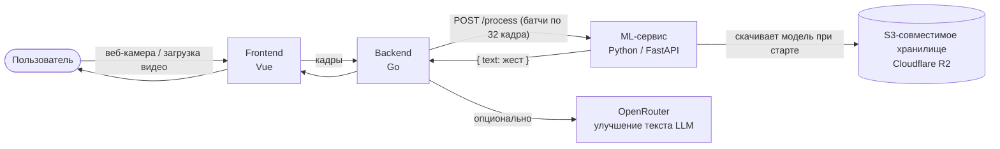
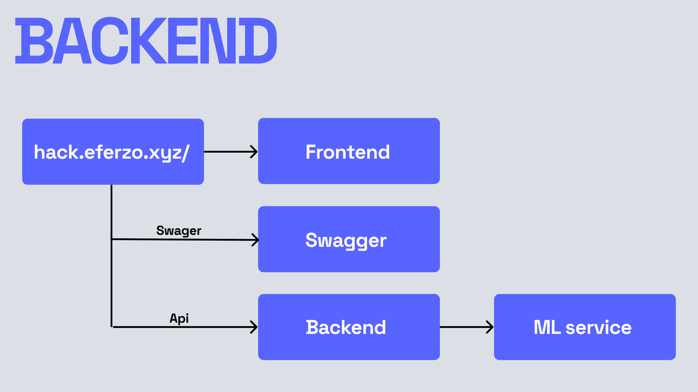
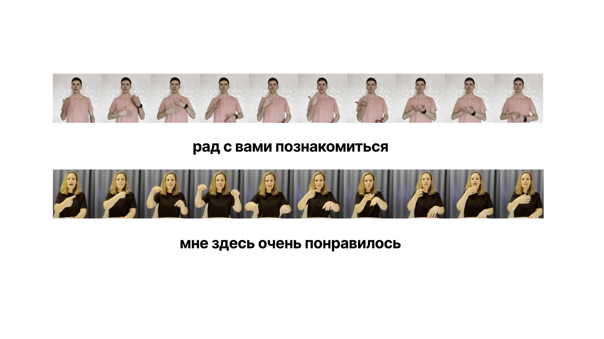
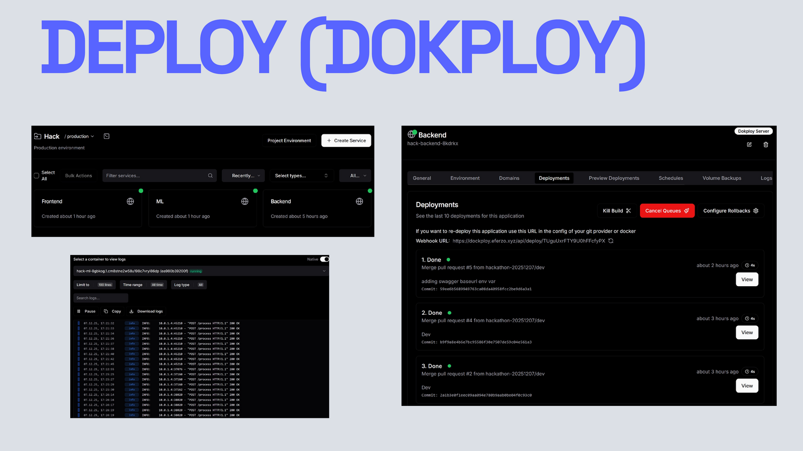

### Переводим русский жестовый язык в текст в реальном времени

[🇬🇧 English](README.md) · **🇷🇺 Русский**

---

## О проекте

**Sigma Sign** — веб-приложение, которое распознаёт **русский жестовый язык (РЖЯ)** по видео с камеры в реальном времени или по загруженному видеофайлу и переводит его в текст. Цель проекта — сделать повседневное общение более доступным для глухих и слабослышащих людей.

Проект начался как **хакатон-проект НИУ ВШЭ** (декабрь 2025, 48 часов) и с тех пор превратился в исследовательскую инициативу. Сейчас мы ищем партнёров среди научных коллективов и лабораторий, работающих над распознаванием жестового языка, непрерывным переводом жестов или ML для доступности — подробнее в разделе [Сотрудничество](#-сотрудничество).

## Проблема

Жестовый язык — полноценный язык со своей грамматикой, но понимают его немногие слышащие люди, из-за чего у носителей жестового языка возникает реальный барьер в повседневном общении. Задача Sigma Sign — снизить этот барьер с помощью инструмента, который работает прямо в браузере, без специального оборудования: нужны только камера и вкладка браузера.

## Как это работает

1. Пользователь заходит на сайт
2. Предоставляет доступ к камере (или загружает видео)
3. Нажимает **Start**
4. Показывает жесты на РЖЯ / загружает видео
5. Получает распознанный текст

## Под капотом: модель

Для такого сценария использования в реальном времени важнее всего два фактора: **скорость перевода** и **точность**. Именно они определили ключевые решения по модели:

- **Архитектура:** S3D (Separable 3D CNN), экспортированная в ONNX для быстрого инференса на CPU/GPU.
- **Предобучение → дообучение:** предобучение на **Kinetics-400** (общее распознавание действий на видео), затем дообучение на **[Slovo](https://github.com/hukenovs/slovo)** — открытом датасете РЖЯ, покрывающем **~1600 классов жестов**.
- **Почему не готовая модель ONNX от Сбера?** Мы протестировали её на раннем этапе и перешли на собственную дообученную модель S3D, сравнив скорость инференса и точность на нашем целевом словаре жестов.
- **Стратегия инференса:** в модель непрерывно подаётся **скользящее окно** кадров (по умолчанию 32); последовательные повторяющиеся предсказания и кадры без жеста схлопываются в чистую итоговую последовательность.

## Архитектура

Backend на Go принимает кадры с веб-камеры по WebSocket (батчами по 32) или извлекает кадры из загруженного видео с помощью FFmpeg, пересылает каждый батч в ML-сервис и опционально переделывает сырой дословный текст в естественный, грамматически связный текст через LLM, сохраняя контекст между батчами для связности.

## Пример работы

*(Фразы «рад с вами познакомиться» и «мне здесь очень понравилось» — распознаны из видео на РЖЯ.)*

## Репозитории

| Репозиторий | Стек | Роль |
| --- | --- | --- |
| [`frontend`](https://github.com/HSE-SignLanguage/frontend) | Vue | Захват кадров с камеры / загрузка видео, отображение переведённого текста |
| [`backend`](https://github.com/HSE-SignLanguage/backend) | Go | Стриминг по WebSocket, обработка загруженных видео, оркестрация, опциональное улучшение текста через LLM, Swagger-документация |
| [`ml`](https://github.com/HSE-SignLanguage/ml) | Python / FastAPI | Инференс S3D/ONNX, возврат распознанных жестов |

В каждом репозитории — свой подробный README (настройка, описание API, конфигурация): начните оттуда, если нужны детали реализации.

## Деплой

Все три сервиса контейнеризованы и деплоятся независимо через [Dokploy](https://dokploy.com/) — self-hosted PaaS с логами и откатом по каждому сервису. Сайт сейчас недоступен публично — напишите нам, если хотите посмотреть демо.

## Известные ограничения

Мы честно обозначаем их, потому что именно здесь исследовательское сотрудничество могло бы помочь больше всего:

- **Распознавание изолированных жестов, а не непрерывной речи** — пока не моделируются грамматика, немануальные маркеры (мимика, артикуляция) и коартикуляция.
- **Фиксированный, закрытый словарь** — ~1600 классов из Slovo; имена, неологизмы и региональные варианты в него не входят.
- **Нет калибровки уверенности между окнами** — перекрывающиеся окна срабатывают независимо, есть только простая дедупликация.
- **Допущения о постановке кадра для одного человека** — фиксированное квадратное масштабирование без кропа по руке/позе.
- **Бенчмарки пока не опубликованы** — формальный протокол оценки точности/задержки в разработке.

## 🗺 Roadmap и открытые исследовательские вопросы

- Непрерывное распознавание жестового языка (на уровне предложений, а не изолированных жестов)
- Учёт немануальных маркеров (мимика, форма губ), несущих грамматическое значение в РЖЯ
- Расширение словаря за пределы ~1600 классов Slovo за счёт сбора дополнительных данных
- Временное сглаживание / голосование между перекрывающимися окнами
- Экспорт под мобильные/edge-устройства (квантование, более лёгкая архитектура) для меньшей задержки
- Формальный протокол бенчмаркинга точности/задержки и публичный лидерборд

## 🤝 Сотрудничество

Sigma Sign начинался как хакатон-проект, призванный сделать повседневное общение доступнее для глухих и слабослышащих людей. Сейчас мы ищем партнёров — **исследователей и лаборатории, работающие над распознаванием жестового языка, непрерывным переводом жестов или ML для доступности**, — в любой точке мира.

Если какой-то из открытых вопросов выше пересекается с вашими исследованиями, будем рады пообщаться: **kuznetsova4ka@gmail.com**

## 📽 Презентация

**[Скачать полную презентацию с хакатона (PDF)](assets/Sigma-Sign-Presentation.pdf)** — постановка проблемы, сравнение моделей, архитектура и деплой.

---

Сделано на хакатоне в НИУ ВШЭ за 48 часов · декабрь 2025

