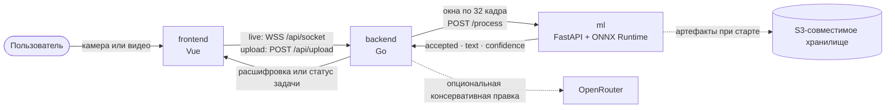

### Распознавание жестов русского жестового языка по видео с камеры или из файла

[🇬🇧 English](README.md) · **🇷🇺 Русский**

**[Открыть демо](https://hack.eferzo.xyz/)** · **[Swagger UI](https://hack.eferzo.xyz/swagger/index.html)**

---

## Что такое Sigma Sign

**Sigma Sign** — экспериментальное веб-приложение, которое распознаёт отдельные жесты **русского жестового языка (РЖЯ)** по видео с камеры в реальном времени или из загруженного файла и собирает текстовую расшифровку. Оно работает в браузере и не требует специального оборудования для захвата видео.

Проект появился на 48-часовом хакатоне НИУ ВШЭ в декабре 2025 года. Сейчас это исследовательский beta-прототип, а не система непрерывного перевода РЖЯ и не замена живому переводчику.

## Архитектура и поток запросов

В live-режиме frontend передаёт JPEG-кадры по одному WebSocket. Backend строит перекрывающиеся окна по 32 кадра с шагом 16 и отправляет их во внутренний ML API. Загруженное видео сначала проверяется через `ffprobe`, затем backend извлекает ограниченное число окон с помощью FFmpeg и отдаёт прогресс через `/job/{id}`.

ML-сервис возвращает метку, уверенность и решение о принятии предсказания. В live-режиме backend подтверждает жест только после двух совпадающих принятых окон. OpenRouter может консервативно поправить грамматику и пунктуацию; он не участвует в выборе жеста и может быть отключён.

## Репозитории

| Репозиторий | Стек | Ответственность |
| --- | --- | --- |
| [`frontend`](https://github.com/HSE-SignLanguage/frontend) | Vue 3 + Vite | Камера, загрузка видео, жизненный цикл WebSocket, опрос задач и интерфейс расшифровки |
| [`backend`](https://github.com/HSE-SignLanguage/backend) | Go + Chi | Публичный API, окна кадров, стабилизация распознавания, video jobs и опциональная правка текста |
| [`ml`](https://github.com/HSE-SignLanguage/ml) | Python + FastAPI + ONNX Runtime | Загрузка артефактов модели, проверка кадров и инференс отдельных жестов |

Каждый сервис собирается и запускается отдельно. Конфигурация и команды разработки находятся рядом с соответствующим сервисом: начните с README в [`backend`](https://github.com/HSE-SignLanguage/backend) или [`ml`](https://github.com/HSE-SignLanguage/ml), а для frontend — со скриптов в [`frontend/package.json`](https://github.com/HSE-SignLanguage/frontend/blob/main/package.json).

## Защита распознавания и стабильность

- **Отсечение неуверенных ответов:** ML-сервис отклоняет `no gesture`, низкую уверенность и малый отрыв top-1 от top-2 вместо возврата любого argmax. Первый принятый жест выводится сразу; удерживаемый жест блокируется до двух нейтральных или отклонённых окон, а прямая смена класса требует подтверждения.
- **Ограниченный live-конвейер:** устаревшая работа заменяется свежей, а не накапливается. Для WebSocket ограничены размер кадра, частота, объём данных, простой, общее число соединений и число соединений на клиента; ML и правка текста используют отдельные bounded queues.
- **Ограниченные загрузки:** файл проверяется до принятия задачи и ограничен по размеру, длительности, разрешению и числу извлечённых кадров. Параллелизм загрузки и обработки также ограничен.
- **Безопасная деградация:** временная перегрузка ML повторяется с ограниченным jitter. Ответ OpenRouter должен пройти строгую append-only JSON Schema за пять секунд; при ошибке или недоступности ИИ используется буквальный распознанный жест.
- **Укреплённые контейнеры:** текущие образы работают от непривилегированных пользователей и имеют health checks. Compose для backend и ML задаёт лимиты ресурсов, а артефакты модели можно закрепить SHA-256-суммами.

## Заметки по деплою

Публичный деплой использует один origin: frontend доступен на `/`, а `/api` направляется в backend с поддержкой WebSocket и удалением префикса. Backend обращается к ML API по внутреннему DNS-имени сервиса; доступ к S3-совместимому хранилищу нужен только ML-сервису.

При деплое:

- указывайте в `ML_API_URL` стабильное внутреннее DNS-имя сервиса, а не `localhost` другого контейнера;
- задавайте в `TRUSTED_PROXY_CIDRS` только реальную сеть ingress, чтобы клиентские лимиты нельзя было обойти через forwarded headers;
- храните ключи S3-совместимого хранилища и OpenRouter в secrets окружения, а не в Git;
- для разработки UI/backend без артефактов модели и внешней LLM используйте `USE_MOCK=true` и `USE_OPENROUTER=false`.

Общего compose-файла на уровне организации намеренно нет: каждый репозиторий отвечает за собственную сборку, тесты и runtime-конфигурацию.

## Известные ограничения

- Модель классифицирует **отдельные жесты в каждом окне** и пока не моделирует непрерывную грамматику РЖЯ, коартикуляцию и немануальные маркеры — мимику и форму губ.
- Production использует S3D-модель и словарь на 1599 выходов из [Easy Sign](https://github.com/ai-forever/easy_sign), в обучающие данные которой входит часть [Slovo](https://github.com/hukenovs/slovo); один Slovo не определяет весь словарь, а имена, новые слова и региональные варианты могут быть вне распределения.
- Фиксированное квадратное масштабирование без трекинга рук и позы делает результат чувствительным к кадрированию, свету, фону и особенностям исполнителя.
- Стабилизация уменьшает шум на переходах, но добавляет задержку и может скрыть намеренный повтор жеста до появления нейтральных кадров.
- ML-репозиторий публикует фиксированный regression sentinel на 20 видео, а не репрезентативный бенчмарк точности и задержки. Live-инстанс имеет намеренно небольшие лимиты и при занятости может вернуть `503`.
- Задачи загрузки и live-сессии хранятся в памяти процесса: рестарт backend прерывает активную работу и не сохраняет состояние задач.
- Опциональная LLM улучшает только оформление текста и не может исправить неверно распознанный моделью жест.

## Исследования и сотрудничество

Открытые направления: непрерывное распознавание, немануальные признаки, расширение данных, временная калибровка и воспроизводимая оценка. Исследователи в области жестовых языков и доступного ML могут написать нам: **kuznetsova4ka@gmail.com**.

История исходного хакатон-проекта сохранена в **[презентации Sigma Sign](assets/Sigma-Sign-Presentation.pdf)**.

---

Сделано студентами НИУ ВШЭ на 48-часовом хакатоне · декабрь 2025

